# Amazon_Vine_Analysis

## Overview of the analysis: 

The purpose of this analysis was to analyze Amazon reviews that were written by members of the paid Amazon Vine program to see if there was an bias with ratings and paid reviews. First we extracted the data, then transformed the data into four different tables. We created a customers dataframe, product data frame, review ID dataframe, and a vine dataframe. 

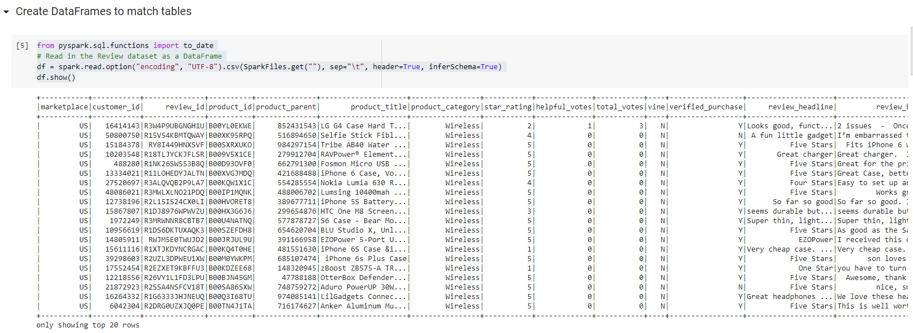
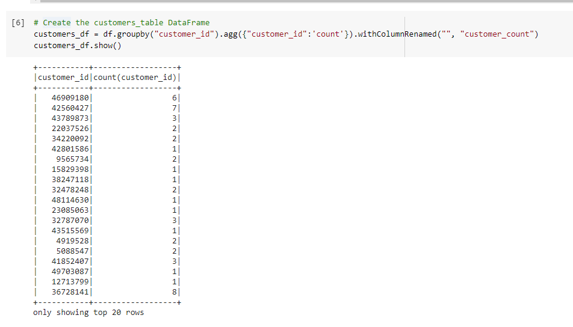
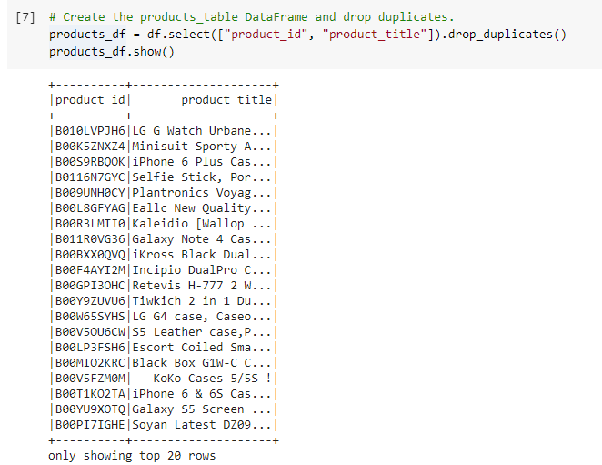
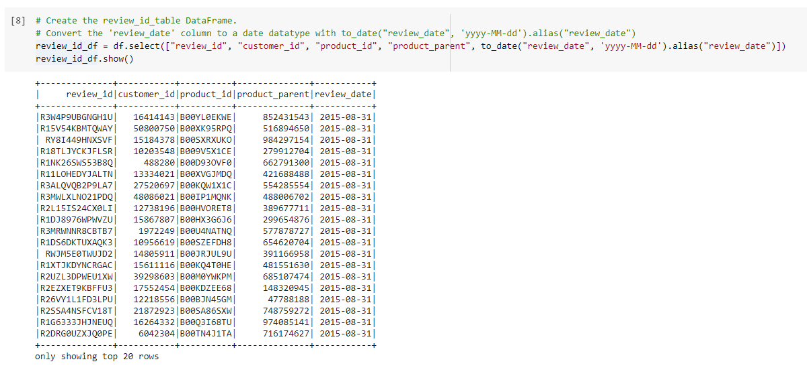
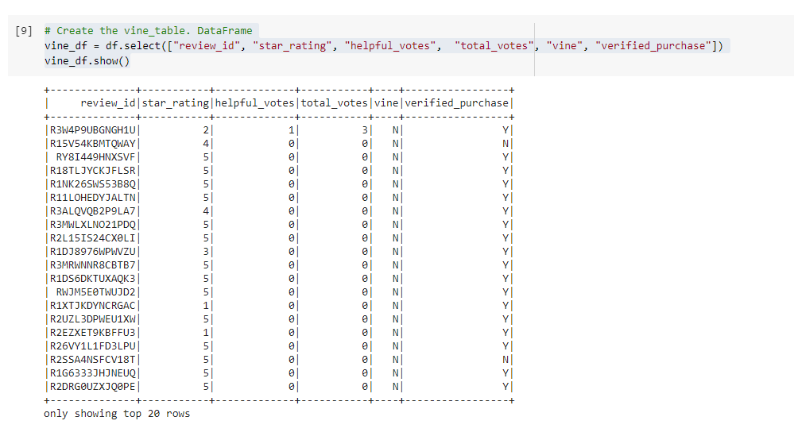

Then we connected to an AWS RDS instance and uploaded the dataframes into PGAdmin. We used pySpark functions to perform an analysis on the data to calculate how many percentage of reviews were Vine/Non Vine as well as how many were 5 star reviews that were Vine or not Vine. To do this, we had to transform the vine dataframe into multiple dataframes. 

First we filtered so we only showed reivews with votes over 20 so we showed reviews that were more likely to be helpful. 
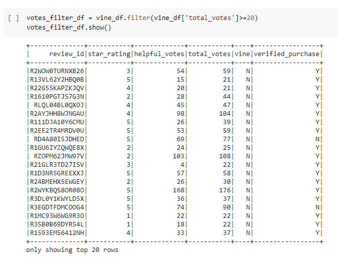

Then we filtered the vine dataframe to only show reviews where helpful votes were more than 50% of total votes. 
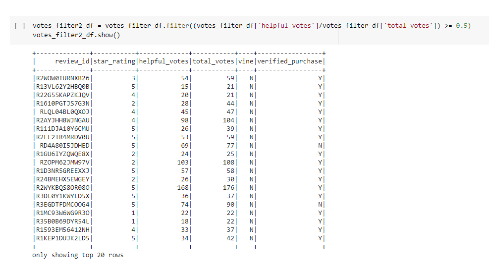

Lastly we separated out the filtered dataframe to create a dataframe for Vine reviews and a dataframe for non Vine reviews.
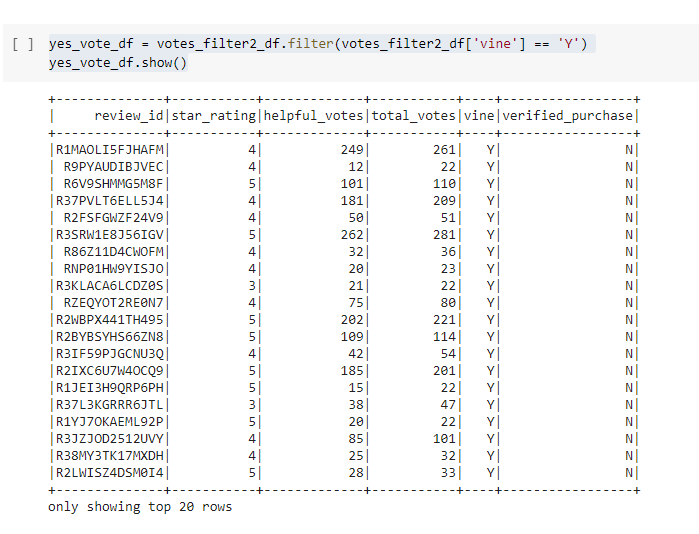
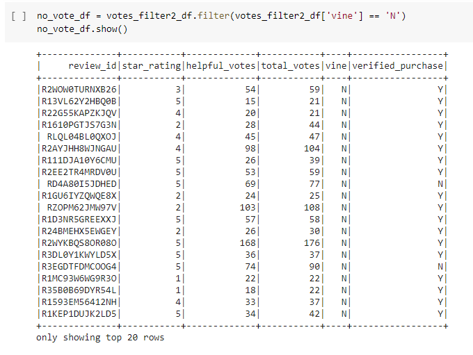

Now we were ready to perform calculation on the dataset to look at percentages of vine and non vine 5 star reviews to see if there was any bias toward favorbale reviews from Vine members.

## Results: 

**How many Vine reviews and non-Vine reviews were there?**

There was 613 Vine reviews and 64,968 non Vine reviews.

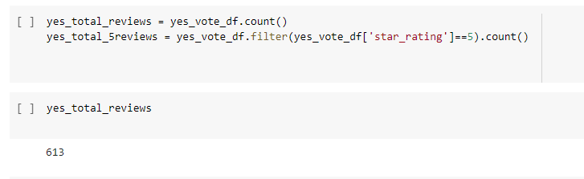
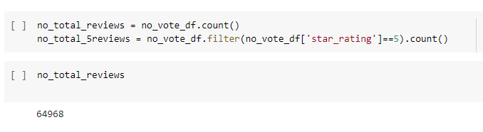

**How many Vine reviews were 5 stars? How many non-Vine reviews were 5 stars?**

There was 222 5 star reviews out of 613 total Vine Reviews. There was 30,543 5 star reviews of out 64,968 non Vine reviews.

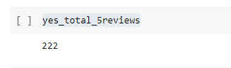
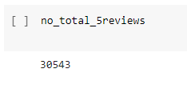

**What percentage of Vine reviews were 5 stars? What percentage of non-Vine reviews were 5 stars?**

36% of Vine reviews were 5 stars whereas 47% of non Vine reviews were 5 stars.

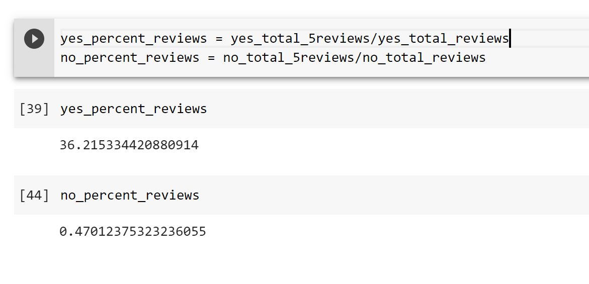

## Summary: 

I do not think there is any positivity bias for reviews in the Vine program.  Only 36% of Vine reviews were 5 stars, where as 47% of non Vine reviews were 5 stars. Since Vine 5 star reviews had a smaller percentage of 5 stars than non Vine, I do not see any bias towards Vine (paid) reviews. If Vine (paid) reviews were majority 5 stars (over 70%) or a higher percentage than non Vine then I would state there could be biased with the paid reviews. But with only 36% of Vine review being 5 star and it is less percentage than non Vine, I do not see any bias.  

An additional analysis we could do would to be take several datasets/products and see if any other datasets had bias. If multiple datasets/products did not have bias then we could more firmly state no bias is shown for paid reviews. We could also look at the average rating for paid vs unpaid reviews.  I'd also perform an analysis on this current data set to see if verified purchases had any bias with 5 star ratings. 
